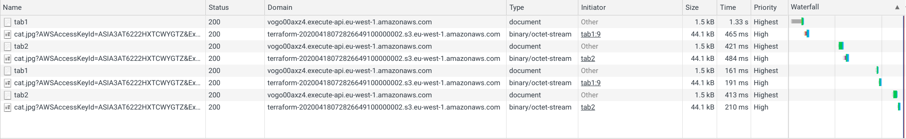
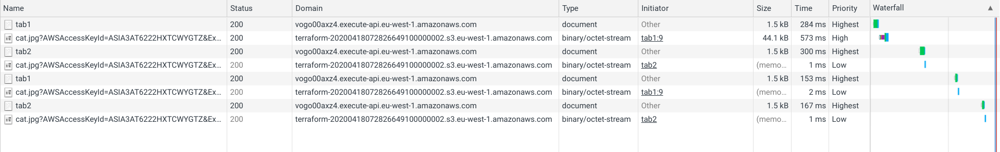

# Demonstration project how to use time rounding to make signed URLs cacheable

To learn more see [this blog post](https://advancedweb.hu/cacheable-s3-signed-urls/).

## How it works

It creates a Lambda function that shows an image using an S3 signed URL in one of two ways.

In the first mode, it uses the current time to calculate the signature. This makes every URL different, so the browser must download the same image over and over again when navigating between the two pages:



In the second mode, the signature is calculated **using a timestamp that is rounded to the last 5-minutes mark**. This makes the resulting URLs that are requested not far from each other to be the same, so the browser does not need to download it again.



## Requirements:

* terraform
* npm

## How to use

* ```terraform init```
* ```terraform apply```
* open the url, choose the mode to try then navigate back and forth between tab 1 and tab 2
* ```terraform destroy```

Note: Make sure *not* to disable cache in the devtools. Also check "Preserve log".

The image is from the [https://thecatapi.com/](https://thecatapi.com/).
